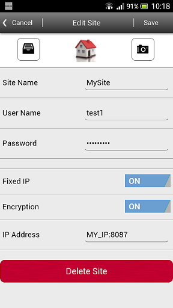

# Siemens SPC Anywhere Proxy

This module makes it possible to continue using Siemens SPC Anywhere App after upgrading of the SPC firmware to version 3.6 FlexC. The main advantage to continue using SPC Anywhere, instead of SPC Connect, is that you can connect to your SPC panel without being dependent of Cloud Services.

SPC Anywhere is available in AppStore and Google Play.

<b>NOTE!</b> To be able to use this module you also need to have SPC Web Gateway from [Lundix IT](http://www.lundix.se/smarta-losningar). SPC Web Gateway is providing a generic open REST and Websocket interface to Siemens SPC intrusion system.

## Limitations
Virtually all features in SPC Anywhere are supported but there are some limitations:
  - Full language support for English and Swedish but limited support for German, French, Italian, Spanish, Dutch and Danish.
  - Full support for System Log. No support for Access Log and WPA Log.
  - No support for Door status and Door commands.
  - Showing live videos is supported, but you have to define a verification zone for each camera. The verification zone IDs must be 1 to 4 (shows up as cam 1 to 4).
  - User credentials are configured in the proxy settings, not in the SPC panel. Default users are test1 (password test1_pwd) and test2 (password test2_pwd).
  - You need to allow SSL communication between the App and SPC Anywhere Proxy and between SPC Anywhere Proxy and SPC Web Gateway.
  
## Installation
### Install NodeJS (example valid only for Raspberry Pi)
	sudo apt-get update
	sudo wget http://node-arm.herokuapp.com/node_latest_armhf.deb
	sudo dpkg -i node_latest_armhf.deb
        
### Install SPC Anywhere Proxy 
	git clone https://github.com/Goran58/spc-anywhere-proxy
	cd spc-anywhere-proxy
	npm install
	
## Configuration

- Modify the settings in config.json according to your environment and SPC Web Gateway settings

## App Settings
Configure the Site settings in the App according following exampel. Note that you have to add the portnumber to the IP address.

 

## Start
	./spc-anywhere-proxy.js
